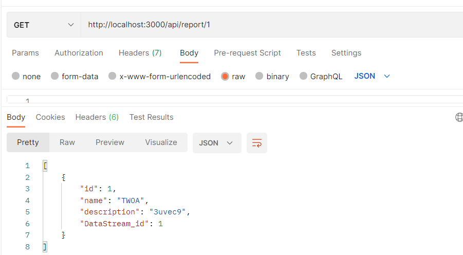
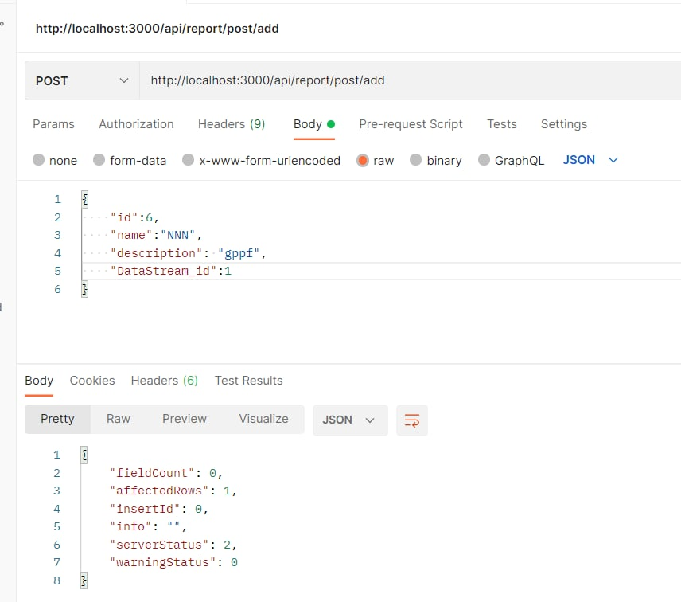
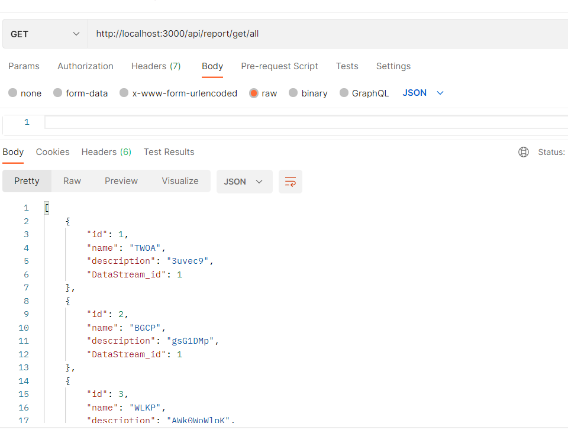
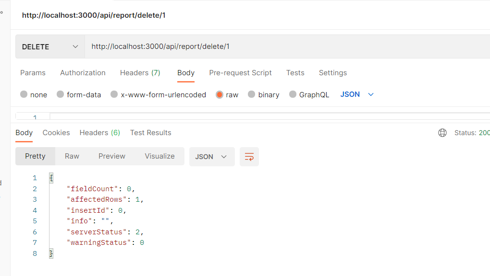
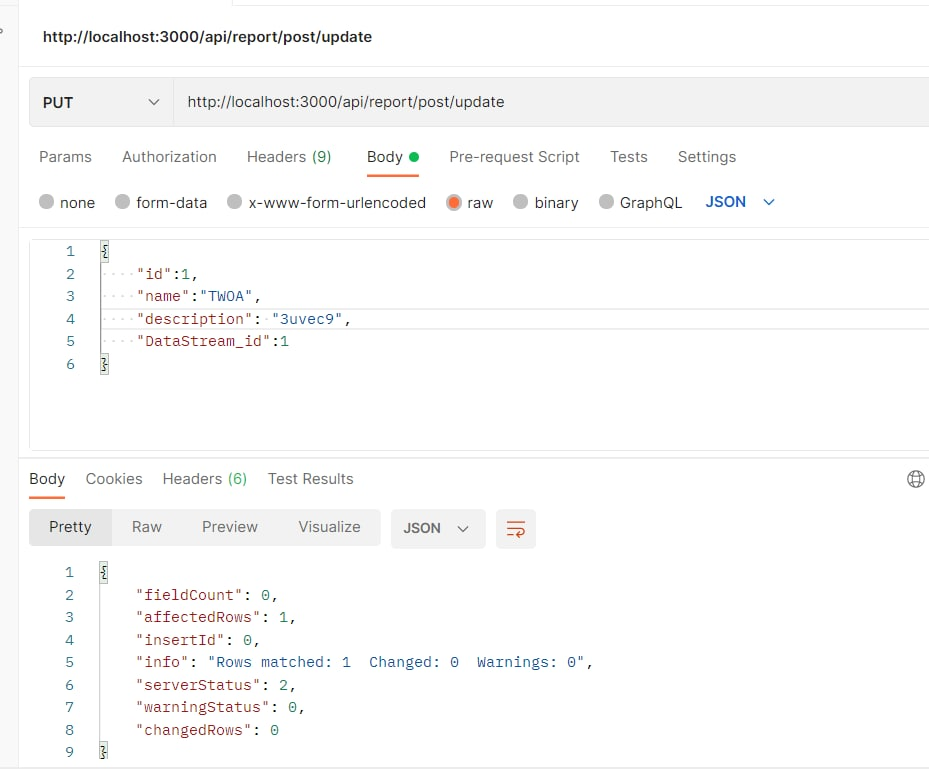

# Тестування працездатності системи

- `/api/report/:id` - Отримати звіт за id

- `/api/report/post/add` - Додати звіт

- `/api/report/get/all` - Отримати усі звіти

- `/api/report/delete/:id` - Видалити звіт за id

- `/api/report/post/update` - Оновити дані

